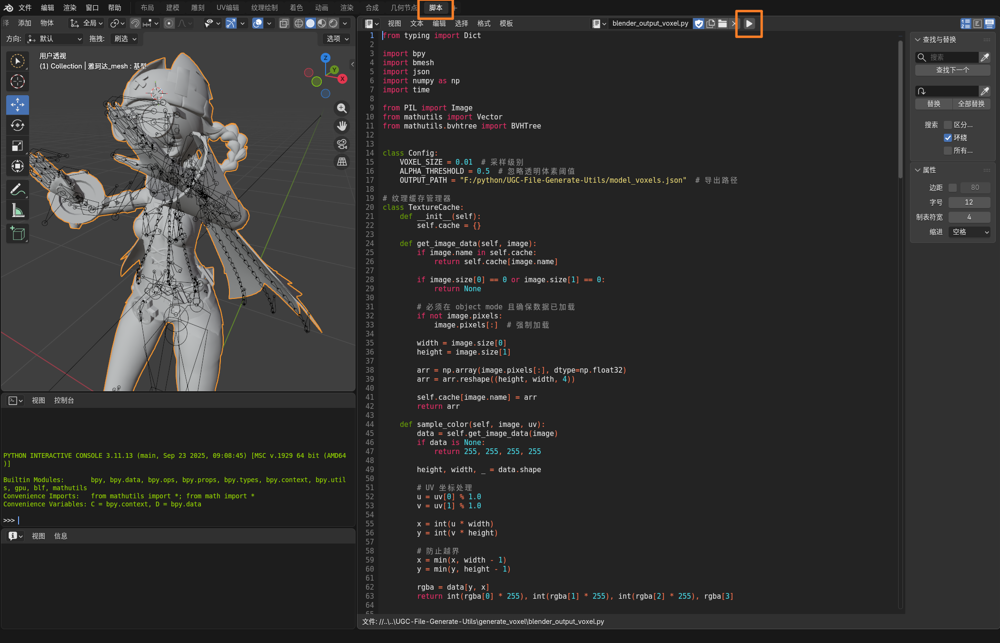
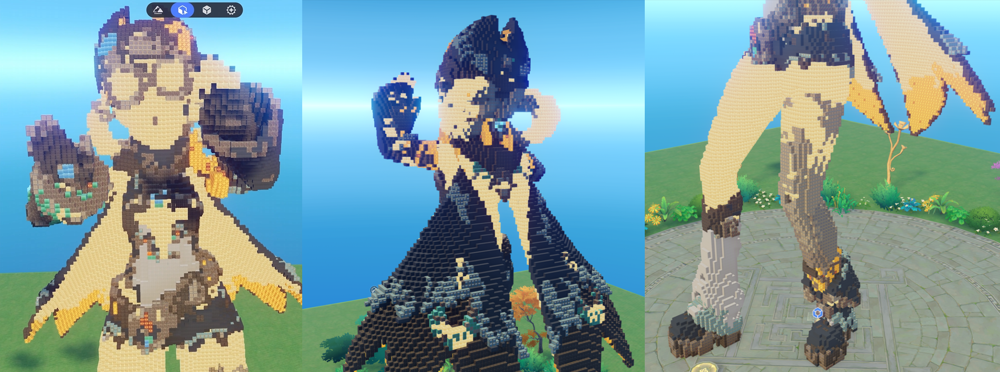

<div align="center">

<h2>3D模型转方块体素模型</h2>

</div>

### 步骤一: 3D模型体素化

##### 需要安装Blender
在Blender中加载模型、摆好姿势后，点击使用`脚本`布局，打开`blender_output_voxel.py`脚本  
选中要体素化的模型，点击运行按钮脚本，体素化后的json文件会保存为目标文件  

##### 编辑 `blender_output_voxel.py` 中的 `Config` 类：

```python
class Config:
    VOXEL_SIZE = 0.01  # 采样级别
    ALPHA_THRESHOLD = 0.5  # 忽略透明体素阈值
    OUTPUT_PATH = "F:/python/UGC-File-Generate-Utils/model_voxels.json"  # 导出路径
```




### 步骤二: 体素数据转方块

将体素模型数据转换为游戏中的体素模型：

```bash
python generate_voxel/generate_voxel.py
```

**输出：**
- `output/voxel_model.gia` - 游戏实体文件

##### 编辑 `generate_voxel.py` 中的 `Config` 类：

```python
class Config:
    GLOBAL_SCALE = 0.01  # 全局缩放

    # 起始位置
    START_POSITION = {
        'x': 0.0,
        'y': 0.0,
        'z': 0.0
    }

    # 实体ID起始值
    ENTITY_ID_START = 1078000000

    # 输入文件路径
    input_file = "../output/model_voxels.json"

    # 导出gia文件
    output_file = "../output/voxel_model.gia"
```

